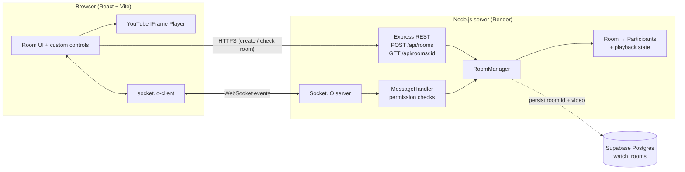
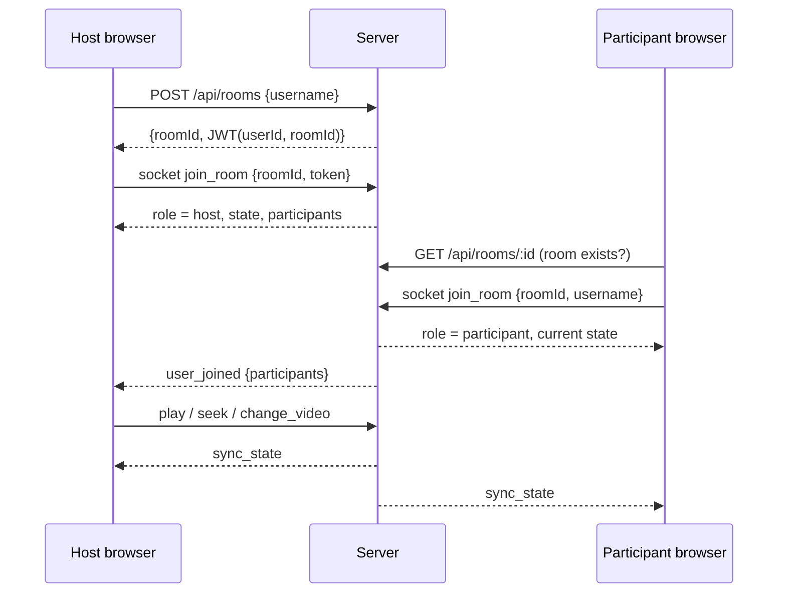
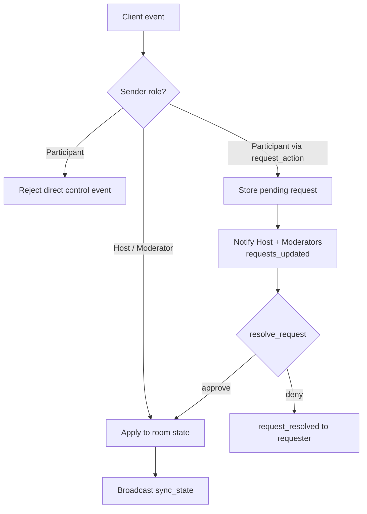

# 🎬 YouTube Watch Party

Watch YouTube together in real time. Create a room, share the code, and everyone sees the same video at the same moment: play, pause, seek and video changes stay in sync. Access is controlled by roles (Host, Moderator, Participant) that are enforced on the server.

| | |
|---|---|
| **Live app** | https://yt-watch-party-lime.vercel.app |
| **Backend (API + WebSocket)** | https://yt-watch-party-wy65.onrender.com (`/health`) |
| **Source** | https://github.com/itsKanika/YT-watch-party |

## 📸 Demo Vedio

https://drive.google.com/file/d/1d21G-slOjeGMIdbcYzikV1X6B1IsCZGE/view?usp=drive_link


---

## ✨ Features

**Core**
- Create a room (you become **Host**) or join with a 6-character code or link
- Real-time sync of play / pause / seek / change video for everyone in the room
- Role-based access control, validated on the backend for every event
- Participant list with live roles and online status

**Roles**

| Role | Assigned by | Permissions |
|---|---|---|
| **Host** | Automatic (room creator) | Play/pause, seek, change video, assign roles, remove participants, transfer host, approve/deny requests |
| **Moderator** | Host | Play/pause, seek, change video, approve/deny requests |
| **Participant** | Default for joiners | Watch, chat, react. Actions are **sent as requests** that the Host/Moderators approve or decline |

**Bonus**
- Request-approval flow for participants
- Transfer host (and automatic host hand-over if the host leaves)
- Live chat and emoji reactions
- Persistent rooms (room id and current video saved in Supabase Postgres)
- OOP server design (`Room`, `Participant`, `RoomManager`, `MessageHandler`)
- JWT-based identity: refreshing the page keeps your user and role

---

## 🧱 Tech stack

| Layer | Technology |
|---|---|
| Frontend | React 18, TypeScript, Vite, Tailwind CSS, `socket.io-client` |
| Video | YouTube IFrame Player API (custom controls) |
| Backend | Node.js, Express, **Socket.IO** (WebSockets) |
| Auth/session | JSON Web Tokens (`jsonwebtoken`) |
| Database | Supabase PostgreSQL via `pg` (optional; falls back to memory) |
| Hosting | Vercel (frontend), Render (backend) |

---

## 🏗️ Architecture



### How real-time sync works
1. The **server is the single source of truth**. Each `Room` stores `{ playState, currentTime, updatedAt, videoId }`.
2. While playing, the live position is calculated as `currentTime + (now − updatedAt)`. This means a late joiner gets the correct position immediately.
3. A permitted action (`play`, `pause`, `seek`, `change_video`) updates the room state, and the server broadcasts **`sync_state`** to everyone in the room.
4. Clients apply that state to the YouTube player. They seek only if they have drifted by more than 1.5 seconds, to avoid stutter.
5. A 10-second `sync_state` tick corrects drift, and clients also resync after a reconnect.
6. The YouTube player's native controls are disabled and covered by an overlay. All interaction goes through the app's own controls, so every action passes through the server and permission checks.

### Room lifecycle and identity

- `POST /api/rooms` creates the room and returns a **JWT** `{ userId, username, roomId }`. The creator's `userId` becomes the room's `hostUserId`, so joining with that token restores the Host role.
- Joiners without a token get a fresh `userId` and the Participant role. Their token is stored in `sessionStorage`, so a refresh reconnects them with the same identity and role (15-second grace period before they are removed).
- If the host leaves, host passes to a moderator, otherwise to the oldest participant.

### Role enforcement and the approval flow

Every privileged event is checked **on the server**. A Participant sending `change_video` directly receives an error, and role changes, removals and host transfer are Host-only. The UI hides or changes controls based on roles, but the backend is the real enforcement.

### WebSocket events

| Event | Direction | Who may send | Purpose |
|---|---|---|---|
| `join_room` | C → S | Anyone | Join a room, receive role, state and participants |
| `leave_room` | C → S | Member | Leave the room |
| `play` / `pause` / `seek` / `change_video` | C → S | Host, Moderator | Control playback |
| `sync_state` | S → C | Server | Broadcast `{ playState, currentTime, videoId }` |
| `request_action` | C → S | Participant | Ask for a control action |
| `resolve_request` | C → S | Host, Moderator | Approve or deny a request |
| `assign_role` | C → S | Host | Set Moderator or Participant |
| `remove_participant` | C → S | Host | Remove a user |
| `transfer_host` | C → S | Host | Pass the Host role on |
| `user_joined`, `user_left`, `role_assigned`, `participant_removed`, `participants_updated` | S → C | Server | Keep the participant list in sync |
| `requests_updated`, `request_resolved` | S → C | Server | Approval-flow updates |
| `chat_message`, `reaction` | both | Member | Chat and emoji reactions |

---

## 📁 Project structure

```
.
├── client/                     React + Vite frontend
│   ├── src/
│   │   ├── Landing.tsx         Landing page
│   │   ├── EntryDialog.tsx     Create / join room dialog
│   │   ├── Room.tsx            Room UI, YouTube player, sync, chat
│   │   └── lib.ts              SERVER_URL, types, helpers
│   └── vercel.json             SPA rewrite for /room/:id
└── server/
    └── src/
        ├── index.js            Express + Socket.IO bootstrap, REST routes
        ├── rooms.js            Participant, Room, RoomManager classes
        ├── handlers.js         MessageHandler: events, validation, JWT
        └── db.js               Optional Postgres persistence (Supabase)
```

---

## 🚀 Run locally

**Prerequisites:** Node.js 18+

```bash
# 1) Server
cd server
cp .env.example .env      # fill in values (see below)
npm install
npm run dev               # http://localhost:4000

# 2) Client (new terminal)
cd client
cp .env.example .env      # VITE_SERVER_URL=http://localhost:4000
npm install
npm run dev               # http://localhost:5173
```

Open two windows (one normal, one incognito). Create a room in one and join it with the code in the other.

### Environment variables

**`server/.env`**
```env
PORT=4000
CLIENT_URL=http://localhost:5173
JWT_SECRET=<long random string>
DATABASE_URL=<Supabase pooler connection string>   # optional
```

**`client/.env`**
```env
VITE_SERVER_URL=http://localhost:4000
```

If `DATABASE_URL` is missing or unreachable, the app still works with in-memory rooms.

---

## ☁️ Deployment

**Backend → Render (Web Service)**
- Root directory: `server` · Build: `npm install` · Start: `npm start`
- Env vars: `JWT_SECRET`, `DATABASE_URL`, `CLIENT_URL` (the frontend origin, comma-separated if several)

**Frontend → Vercel**
- Root directory: `client` · Framework: Vite
- Env var: `VITE_SERVER_URL=https://yt-watch-party-wy65.onrender.com`
- `client/vercel.json` rewrites all routes to `index.html` so `/room/:id` links work on refresh

**Deployment notes**
- CORS: the server allows the origins in `CLIENT_URL` plus `*.vercel.app` preview URLs.
- Vite bakes `VITE_*` variables in at build time, so redeploy the client after changing them.
- Supabase: the Render server uses the **pooler** connection string (the direct host is IPv6-only).

---

## ⚖️ Design decisions and trade-offs

- **Socket.IO over raw `ws`:** built-in rooms, reconnection and fallback transports reduced boilerplate.
- **Server-authoritative state:** the server calculates the live playback position, which fixes late joiners and prevents clients from drifting apart.
- **Custom player controls:** disabling native controls guarantees that every action goes through the server and permission checks.
- **In-memory room state:** fast and simple. Only room id and video are persisted, so participants and playback position don't survive a server restart.
- **Scaling path:** the server is single-instance today. To go beyond that, add the Socket.IO Redis adapter (Pub/Sub for cross-instance broadcast) with sticky sessions behind a load balancer, and move participant and playback state into Redis.
- **Browser autoplay policy:** some browsers block autoplay with sound, so a "Tap to join playback" button appears when needed.

---

## 🧪 Quick test checklist
1. Create a room and copy the code.
2. Join from a second window (incognito) as a Participant. Its controls say "Request play / pause".
3. As Host, play, pause and seek, and confirm the second window follows.
4. Send a request from the Participant and approve it as Host.
5. Promote the Participant to Moderator, then confirm direct control works.
6. Change the video from a pasted YouTube link.
7. Transfer host, then remove a participant.

---

Built by **Kanika Gupta** for the Full Stack Intern assignment.
